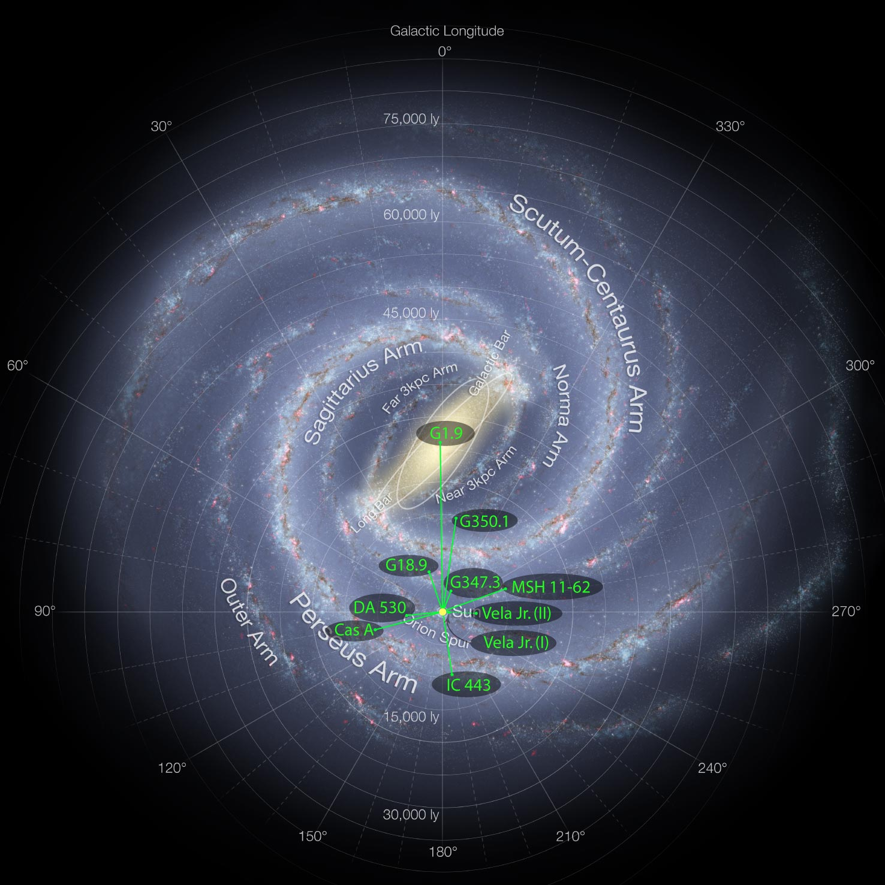

# Classification-of-continuous-gravitational-wave-candidates-with-a-random-forest
Classification of continuous gravitational wave candidates with a random forest
---

If you've been paying attention to science news over the last year or two, you'd notice that [gravitational waves](https://en.wikipedia.org/wiki/Gravitational_wave) have revolutionized how we see (or 'hear') the Universe. Looking into data from the [LIGO](www.ligo.org) gravitational-wave observatories, we have seen the largest stellar-mass black holes spiral into each other, causing the very fabric of space-time itself to reverberate. We've seen neutron stars collide, in turn illuminating where Earth got all its heavy metals—including gold and platinum.

However, we have yet to see gravitational waves from spinning neutron stars. I search within LIGO data for the faint hum that may be given off by neutron stars in the ashes of 'recent' star explosions ([supernovae](https://en.wikipedia.org/wiki/Supernova)). Here is a roadmap of the supernova remnants searched for in our Galaxy (the Sun is the yellow dot):

## What's the problem?

These searches are very expensive (each target took almost half a million CPU hours on a modern computing cluster). They generate a _lot_ of potential candidates. Currently, these have to be checked manually, by hand, to rule out if they are the result of something physically plausible, or are merely artifacts of the instruments (which we expect most of them to be). This is a problem ripe for an attack from Machine Learning!

Candidates can look like this:

or this:

To cut down on the tedium and manpower required to perform such classification, we wish to construct a classifier to classify potential candidates as detections ('signal'), instrumental lines ('line') or merely noise ('noise').

## Selecting an appropriate Machine Learning algorithm

Deep Learning is currently a (sometimes expensive) hammer looking for any nail it can find. And it does this surprisingly well. However, one issue with internalizing features, one of the beauties of Deep Learning, is that it can make interpretation of _how_ features were selected. In the words of the famous physicist Eugene Wigner: "It's nice that the computer understands the problem. But I would like to understand it too."

Depending upon how features are distributed within the parameter space of the data, a variety of Machine Learning algorithms (MLAs) could be applied. One that goes a surprising way, that is fairly robust, conceptually simple (and obviously one of my favorites) is the random forest. 

